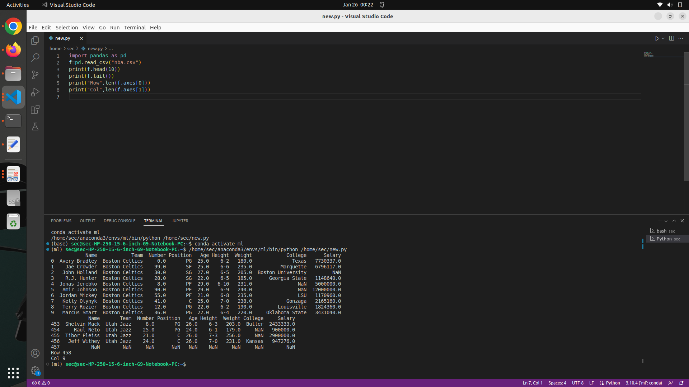

# Read-from-CSV

## AIM:
to write the python program to reading content from csv file
## ALGORITHM:
### Step 1:
import pandas from pd
### Step 2:
read the csv file using read_csv method
### Step 3:
use head and tail method to get the requiered  content from the file
### Step 4:
Use head and tail method to get the required contents from the file.
### Step 5:
Use len() method to get the number of rows and columns.
## PROGRAM:
```
import pandas as pd
f=pd.read_csv("nba.csv")
print(f.head(10))
print(f.tail())
print("Row",len(f.axes[0]))
print("Col",len(f.axes[1]))
```
## OUTPUT:

## RESULT:
Thus a python program is written to read the contents of a CSV file.